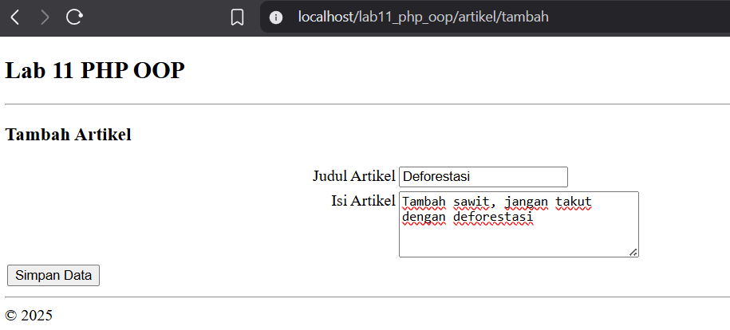
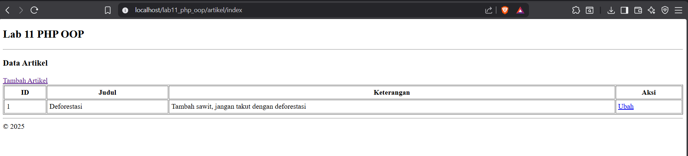
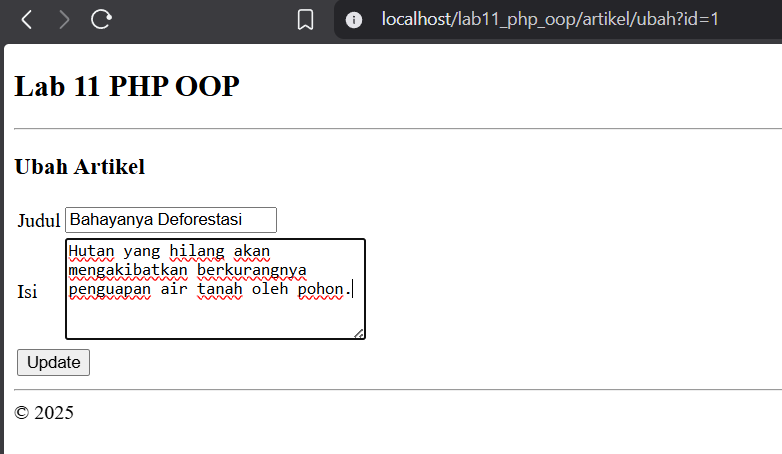
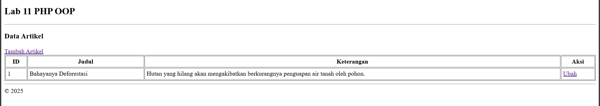

# Praktikum 11: PHP OOP Lanjutan

## Nama: Albhani Fadillah Haryady
## NIM: 312410130
## Kelas: TI 24 A1

### langkah-langkah 

#### Struktur folder
```
lab11_php_oop/
├── .htaccess
├── config.php
├── index.php
├── class/
│ ├── Database.php
│ └── Form.php
├── module/
│ └── artikel/
│ ├── index.php
│ ├── tambah.php
│ └── ubah.php
├── template/
│ ├── header.php
│ ├── footer.php
│ └── sidebar.php
```

#### Membuat Class OOP (Database & Form)
##### Database.php
- query()
- get()
- insert()
- update()

##### Form.php
- addField()
- displayForm()

#### Konfigurasi config.php

```
<?php
$config = [
    'host' => 'localhost',
    'username' => 'root',
    'password' => '',
    'db_name' => 'latihan_oop'
];
?>
```

#### Implementasi

##### 1. Tambah List



##### 2. Ubah


